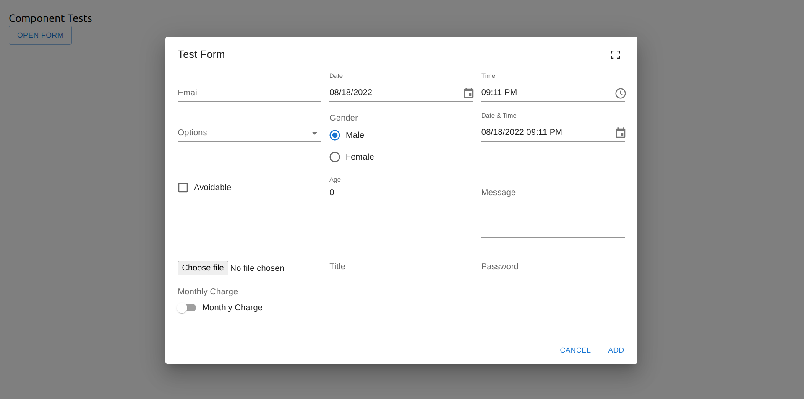
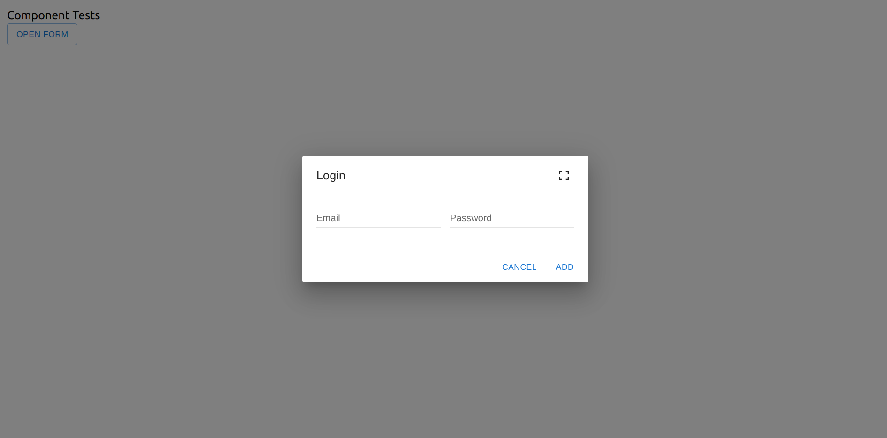
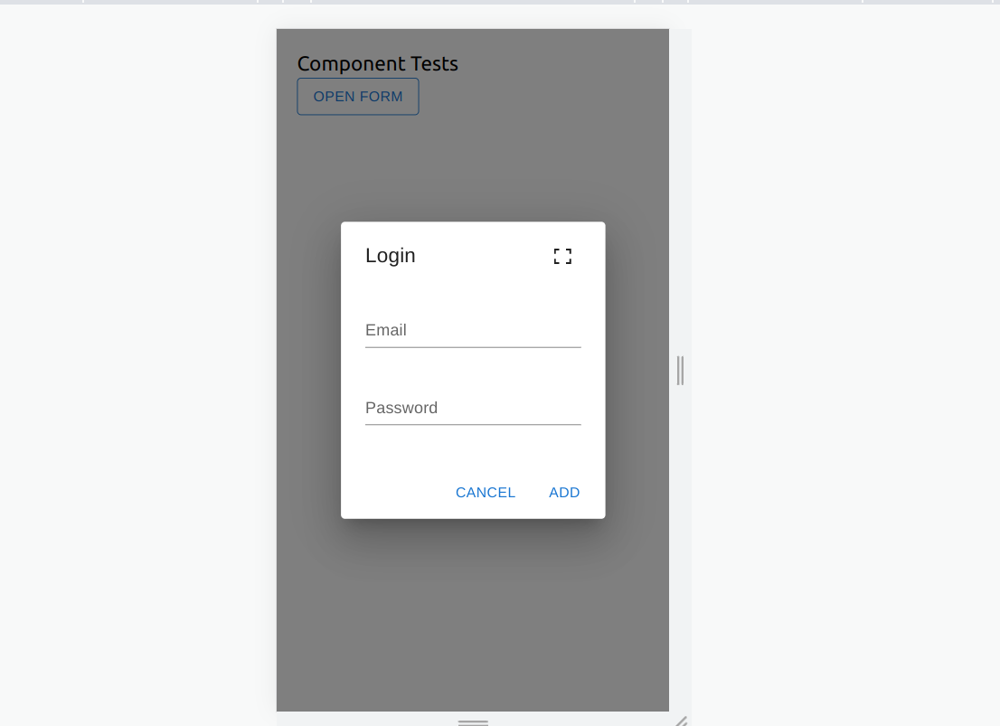

# GenerateForm Component

## GenerateForm
This is a component that can be used to create forms dynamically. It is a sequence form creator i.e. it creates the form in the order specified.

### config
The config object is used to give metadata about the form to be created.

The config object has 5 main properties;
1. **Title**
    
    This specifies the title of them form.
2. **Elements**

    This is an array of objects that helps user define the form elements. More on this below
3. **Large Device**

    This is an object that specifies the number of columns a form will have on a large device.
4. **Medium Device**

    This is an object that specifies the number of columns a form will have on a large device.
5. **Small Device**

    This is an object that specifies the number of columns a form will have on a large device.

This is an object that should contain the following structure

#### Example

```javascript
{
    title: 'Title of the form',
    elements: [
        {
            name: 'email',
            type: 'email-field', // check types
            label: 'email',
            defaultValue: '',
            placeholder: 'Enter your email',
            dropdownList: [{}], // for dropdown field
            radioList: [], // for radio field
            rows: 4 // for multiline field
        }
    ],
    largeDevice: {
        columns: 3
    },
    mediumDevice: {
        columns: 2
    },
    smallDevice: {
        columns: 1
    },
}
```

#### Elements
This property is worth looking at. An object in it has several properties:

1. **name**  
This field ```mandatory```. It is the one used to store the value entered in the field.

2. **type**
    
    This field ```mandatory```. It is used to describe the type of element to create.

    *Types of elements*
    
    1. ```email-field```

        Form emails.
    2. ```date-picker```

        For dates
    3. ```time-picker```

        For time
    4. ```dropdown```

        For dropdowns
    5. ```radio```

        Form radio fields
    6. ```datetime-picker```

        For datetime picker
    7. ```checkbox```

        For checkbox
    8. ```number-field```

        For numbers
    9. ```message-field```

        For multiline messages
    10. ```file-field```

        For files
    11. ```text-field```

        For single line of text
    12. ```password-field```

        For passwords
    13. ```switch-field```

        For a switch field.

**All fields in use**


3. label

    This is a label that will appear on the field. ```Not available on some fields. Look at picture above```
4. defaultValue

    This will be the default value for your field. ```The default value depends on the element been created. Especially when it comes to dropdowns and radio fields.```
5. dropdownList

    This is an array of objects that should be given while defining an element. The componenet will use this to display the contents of the drop down. Look the example below; 

    ```javascript
    [
        { 
            label: 'The Shawshank Redemption', 
            year: 1994 
        },
        { 
            label: 'The Godfather', 
            year: 1972 
        },
        { 
            label: 'The Godfather: Part II', 
            year: 1974 
        }
    ]
    ```

    ```This component needs some additional features that will allow user to specify which property should be rendered.```
6. radioList

    This is an array that should be given while defining a radio field. The componenet will use this to render the options.

    ```javascript
    ['Male', 'Female']
    ```

7. rows

    This is a number that should be provided for a multiline field. The number describes the rows the field will have.
8. placeholder

    This is just some information that will appear on some forms.

### Usage
1. Create a file in our main project
	```
	LoginForm.jsx
	```
2. Copy and paste the following code
	```javascript
		import  React  from  'react'
		import  GenerateForm  from  './GenerateForm'
		
		const  LoginForm = () => {
			const  config = {
				title:  'Login',
				elements: [
					{
						name:  'email',
						type:  'email-field',
						label:  'Email',
						defaultValue:  '',
						placeholder:  'Enter your email'
					},
					{
						name:  'email',
						type:  'password-field',
						label:  'Password',
						defaultValue:  '',
						placeholder:  'Enter your email'
					},
				],
				largeDevice: {
					columns:  2
				},
				mediumDevice: {
					columns:  2
				},
				smallDevice: {
					columns:  1
				},
			}

		return (
			<GenerateForm config={config}  />
		)
	}
	
	export  default  LoginForm
	```
3. Run the component where its needed

*Large & Medium Device View*


*Small Device View*
